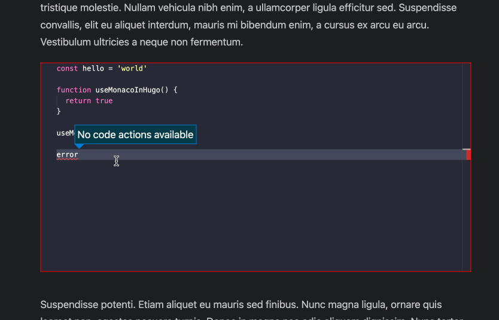

# monaco-editor-hugo

A demonstration for how to use the [monaco editor](https://microsoft.github.io/monaco-editor/) as a [Hugo shortcode](https://gohugo.io/content-management/shortcodes/)

## How it Works

- Renders a `monaco editor` with code inside it

## How to Use It

- Add `monaco.html` as a shortcode
  - You can customise this to suit your needs (the theme etc)
- Add code in `extend_footer.html` to the footer of your site (or bottom of the body)
- Use the shortcode as in `example_use.md`

You will need to handle styling yourself. Please see the `id` of the `div` that serves as the container for monaco editor.

Everything about the configuration of monaco editor itself can be tweaked in the shortcode.

The exact implementation will depend on the theme you use (e.g. [PaperMod](https://github.com/adityatelange/hugo-PaperMod))
